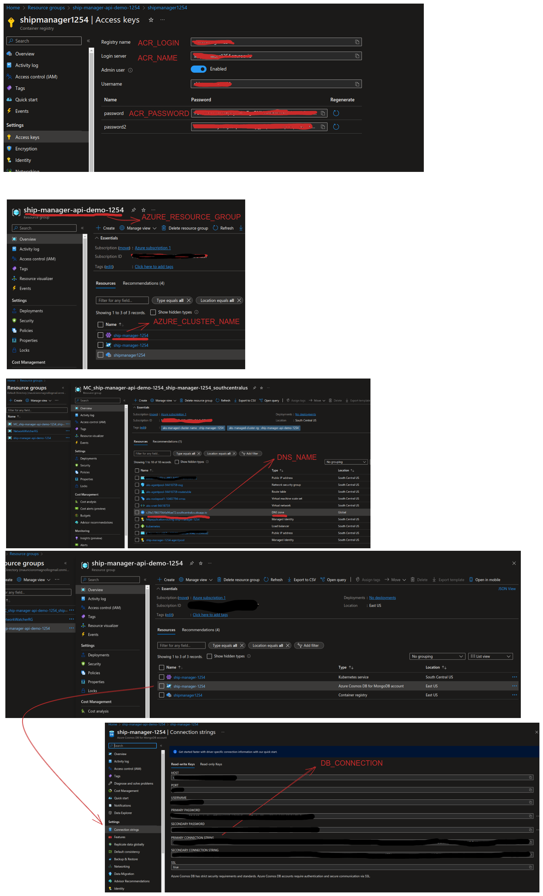

# Creating Azure Infrastructure

- Create one Microsoft Azure account
- [Install Azure CLI](https://learn.microsoft.com/en-us/cli/azure/install-azure-cli)
- Install `kubectl`:

```sh
sudo az aks install-cli
```

- Make login in Azure using `az` cli:

```sh
az login
```

- Set Environment Variables:

```sh
export UUID=$RANDOM
export RG="ship-manager-api-demo-$UUID"
export RESOURCENAME="ship-manager-$UUID"
export ACR="shipmanager$UUID"
```

- Create one Resource Group on Azure

```sh
az group create -l eastus -n $RG
```

- Create CosmosDB:

```sh
az cosmosdb create --kind MongoDB --enable-free-tier -n $RESOURCENAME -g $RG
```

- Create ACR:

```sh
az acr create -n $ACR --sku Basic -g $RG
```

- Update:

```sh
az acr update -n $ACR --admin-enabled true
```

- Create Kubernetes Cluster:

```sh
az aks create -n $RESOURCENAME -g $RG -a http_application_routing -l southcentralus -s Standard_B2s --attach-acr $ACR --generate-ssh-keys -c 2
```

- Get credentials and set to kubectl:

```sh
az aks get-credentials -n $RESOURCENAME -g $RG --admin
```

- Check if kubectl is already:

```sh
kubectl config get-contexts
```

```sh
kubectl get nodes
```

## Setup Github Secrets

You need setup this Github secrets variables (Repository > Settings > Secrets and variables > Actions > New repository secret):

```sh
ACR_LOGIN
ACR_NAME
ACR_PASSWORD
AZURE_CLUSTER_NAME
AZURE_CREDENTIALS
AZURE_RESOURCE_GROUP
DB_CONNECTION
DNS_NAME
```

See how to get the variables values with this images:




- AZURE_CREDENTIALS

```sh
SUBSCRIPTION_ID=$(az account show --query id -o tsv)
```

```sh
az ad sp create-for-rbac --role contributor --scopes /subscriptions/$SUBSCRIPTION_ID/resourceGroups/$RG --sdk-auth
```

Copy the JSON Output and set to AZURE_CREDENTIALS Github secret.

## Deleting Azure Infrastructure

```sh
az group delete -n $RG --no-wait --yes
```
